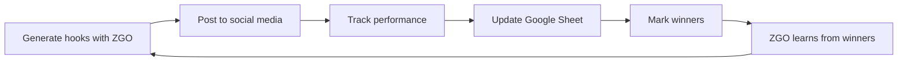

# Enhanced Google Sheets Memory Layer - Performance Tracking

## What's New

### 🎯 Performance-Based Learning
The memory layer now tracks **actual performance metrics** and learns from **winning content**.

### 📊 New Content_Library Columns

| Column | Purpose | Example |
|--------|---------|---------|
| `impressions` | Total reach | 50,000 |
| `views` | Video views | 12,000 |
| `watch_time` | Avg watch time (sec) | 45.3 |
| `clicks` | Link clicks | 850 |
| `engagement_rate` | Overall engagement % | 24.5 |
| `posted` | Published status | yes/no |
| `winner` | Top performer flag | yes/no |
| `notes` | Context/tags | "WINNER - Best Q4" |

---

## How It Works

### 🧠 Smart Hook Prioritization

**Before:** ZGO learned from all hooks equally  
**Now:** ZGO prioritizes WINNERS

```typescript
// getBestHooks() sorting logic:
1. Winners first (winner === true)
2. Then by engagement_rate (descending)
3. Returns top 5 to inject into prompt
```

### ✍️ Manual Feedback Loop

You can now track real performance:

1. **Generate** content with ZGO
2. **Post** it to TikTok/IG (mark `posted: yes`)
3. **Track** metrics (views, engagement, etc.)
4. **Mark winners** (`winner: yes`) for top performers
5. **Next run**: ZGO learns from your best content!

---

## Example Use Cases

### Use Case 1: Weekly Performance Review
```
Every Monday:
1. Check last week's Content_Library rows
2. Update metrics from TikTok/IG analytics
3. Mark top 2-3 hooks as "winner: yes"
4. Run ZGO → it now learns from your best!
```

### Use Case 2: A/B Testing
```
Post 2 versions of a hook:
- Hook A: "Stop scrolling..." → 5% engagement
- Hook B: "This changed everything..." → 25% engagement ← WINNER

Mark Hook B as winner → future hooks will be more like B
```

---

## Test Data Added

Three sample hooks were added to demonstrate the system:

🏆 **WINNER** - TikTok hook  
- 50K impressions, 12K views
- 24.5% engagement rate
- Marked as winner

✅ **Posted but not winner** - Instagram  
- 35K impressions, 8.5K views
- 12.7% engagement (good but not top)

📅 **Scheduled** - Not yet posted  
- 0 views (planned for next week)

---

## Updated Code

### `BestHook` Interface
```typescript
export interface BestHook {
    text: string;
    platform: string;
    impressions?: number;
    views?: number;
    watch_time?: number;
    clicks?: number;
    engagement_rate: number;
    posted?: boolean;
    winner?: boolean;  // ← NEW: Marks top performers
}
```

### `saveHook()` Function
```typescript
await saveHook(
    "Your hook text...",
    "TikTok",
    {
        impressions: 50000,
        views: 12000,
        engagement_rate: 24.5,
        posted: true,
        winner: true,  // ← Mark as winner!
        notes: "Best Q4 performer"
    }
);
```

---

## Next Steps

### To Use This System:

1. **Open** ["Zenthia Brain" Sheet](https://docs.google.com/spreadsheets/d/1C-gOS7MgygKaHo9Hyh7q9VrQ1yiW7xneEFvwbp2yQ6c/edit)

2. **Check** Content_Library tab → See test data with metrics

3. **Run** ZGO:
   ```bash
   node test-api-client.js
   ```

4. **Manually update** metrics for posted content:
   - Add view counts from TikTok analytics
   - Calculate engagement rates
   - Mark winners (`yes` in winner column)

5. **Watch** ZGO learn and improve over time! 🧠

---

## The Scoring/Feedback Loop 🔄



**The cycle continues** - each iteration makes ZGO smarter!

---

## Files Modified

- ✅ `app/api/agents/run/memory/google-sheets.ts`
  - Enhanced `BestHook` interface
  - Updated `getBestHooks()` to prioritize winners
  - Updated `saveHook()` to accept full metrics
  - Updated `saveContentPlan()` compatibility

- ✅ Google Sheet: "Zenthia Brain"
  - Added 11-column header to Content_Library
  - Added sample test data

---

## Success! 🎉

Your ZGO now has:
- ✅ Performance tracking
- ✅ Winner prioritization
- ✅ Manual scoring capability
- ✅ Feedback loop for continuous learning

**The system gets smarter with every post you track!**
